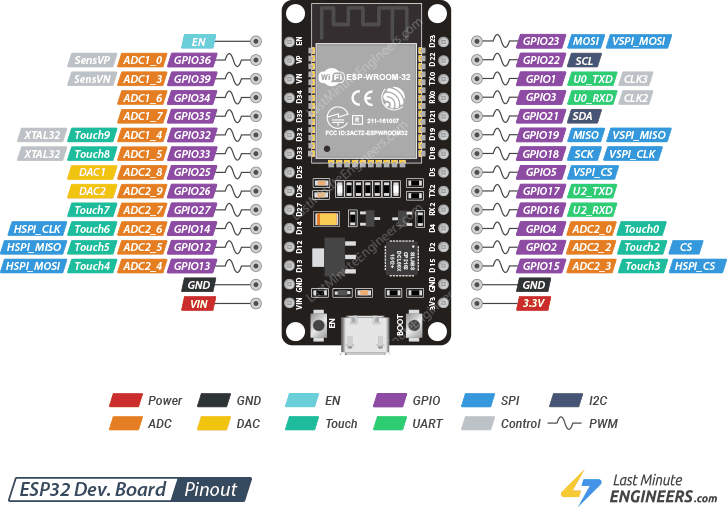
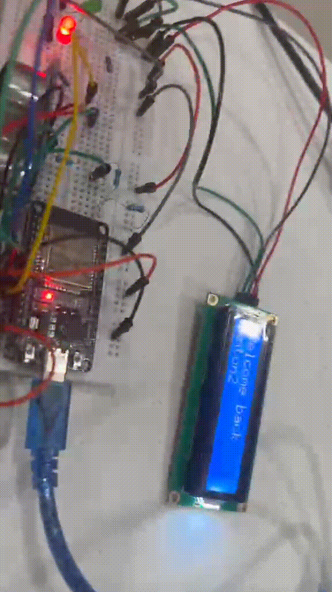

# Final Project - Home Greeting System with Face Recognition


A face recognition kiosk: train a model, serve it with FastAPI, and let an ESP32 pull the live greeting state to display on hardware.

[English](README.md)

## Table of Contents

- [Description](#description)
- [Tech Stack](#tech-stack)
- [How to Run](#how-to-run)
- [Analysis Results From Last Snapshot](#analysis-results-from-last-snapshot)
- [ESP32 Setup (Backend Integration)](#esp32-setup-backend-integration)
- [Specifications](#specifications)
- [Actual Demonstration: Connect ESP32 to Backend](#actual-demonstration-connect-esp32-to-backend)

<a id="description"></a>

<details open>
<summary><strong>Description</strong></summary>

A greeting system that trains a model to recognize faces through TensorFlow and Keras. An ESP32 controller calls a Python backend to display the name of a recognized face on the frontend kiosk.

</details>

<a id="tech-stack"></a>

<details open>
<summary><strong>Tech Stack</strong></summary>

- Python
- TensorFlow
- Keras
- ESP32
- FastAPI (Backend)
- React (Vite) (Frontend)

</details>

<a id="how-to-run"></a>

<details open>
<summary><strong>How to Run</strong></summary>

1. First, clone the repository and navigate to the backend directory:

```bash
git clone
```

2. Install the required dependencies for the backend:

```bash
cd backend
pip install -r requirements.txt
```

Optionally, you can install the dependencies through the uv package manager:

```bash
uv sync
```

3. Gather the dataset by following the prompts by running:

```bash
python backend/scripts/01a_collect_faces.py
```

The data will be stored in [backend/dataset](backend/dataset), with training data in [backend/dataset/train](backend/dataset/train) and validation data in [backend/dataset/value](backend/dataset/value).

4. Train the model using the provided training script. You may use any of the notebooks found in [backend/scripts/training](backend/scripts/training). For example, to train using the EfficientNetV2B0 backbone, run:

```bash
python backend/scripts/training/02_train_model_2.ipynb
```

For [backend/scripts/training/02_train_dense.ipynb](backend/scripts/training/02_train_dense.ipynb), generate the landmark CSVs first by running [backend/scripts/01b_landmark_extraction.py](backend/scripts/01b_landmark_extraction.py). For [backend/scripts/training/02_train_model_1.ipynb](backend/scripts/training/02_train_model_1.ipynb) and [backend/scripts/training/02_train_model_2.ipynb](backend/scripts/training/02_train_model_2.ipynb), you can skip landmark extraction.

5. After training, the model is saved in [backend/models](backend/models). Start the backend server from the backend folder:

```bash
cd backend
uvicorn main:app --reload --host 0.0.0.0 --port 8000
```

You can change which model file to use by updating `MODEL_PATH` in [backend/app/main.py](backend/app/main.py).

6. Start the frontend server:

```bash
cd frontend
npm install
npm run dev
```

You can also use bun:

```bash
cd frontend
bun install
bun run dev
```

7. The frontend should now be running at `http://localhost:5173`. You can test face recognition by showing your face to the camera in the frontend. If recognized, the name is displayed on the kiosk and printed in the ESP32 serial monitor.

</details>

<a id="analysis-results-from-last-snapshot"></a>

<details open>
<summary><strong>ANALYSIS RESULTS FROM LAST SNAPSHOT</strong></summary>

This summary is intentionally privacy-safe. It describes the latest saved model snapshot without naming any enrolled subject and without showing any face images.

Latest snapshot summary:

- Training images: `480`
- Validation images: `120`
- Enrolled identities: `2`
- Validation accuracy: `0.9917`
- Validation loss: `0.0397`
- Correct validation predictions: `119 / 120`
- Misclassifications: `1`
- Mean confidence on correct predictions: `0.9740`
- Mean confidence on incorrect predictions: `0.7755`
- Best validation epoch from the saved history: `5`

What the model did well:

- strong validation performance on the held-out split
- low validation loss together with very high validation accuracy
- clean separation between the enrolled identities, with only one saved validation mistake
- stable transfer-learning behavior from the EfficientNetV2B0 backbone
- high confidence on most correct predictions

- Do not commit generated notebook artifacts that may contain face images, private filenames, or identity labels.
- The generated outputs under `backend/scripts/training/artifacts/` are ignored by git on purpose.
- If you need charts for analysis, run [backend/scripts/training/02_train_model_2.ipynb](backend/scripts/training/02_train_model_2.ipynb) locally and generate your own private outputs on a trusted machine.

Safe outputs to discuss publicly:

- training and validation accuracy curves
- training and validation loss curves
- redacted confusion matrices
- confidence summaries
- aggregate metric tables

Outputs that should remain local only:

- sample face grids
- example prediction images
- raw prediction exports tied to private identities

</details>

<a id="esp32-setup-backend-integration"></a>

<details open>
<summary><strong>ESP32 Setup (Backend Integration)</strong></summary>

This project includes ESP32 firmware in [backend/esp32](backend/esp32) that polls backend endpoints such as `/api/kiosk-status` and `/api/health`.

### 1. Install Arduino IDE

- Download and install Arduino IDE from https://www.arduino.cc/en/software

### 2. Configure Arduino IDE for ESP32

1. Open Arduino IDE.
2. Go to `File > Preferences`.
3. In `Additional boards manager URLs`, add:

```text
https://raw.githubusercontent.com/espressif/arduino-esp32/gh-pages/package_esp32_index.json
```

4. Go to `Tools > Board > Boards Manager`.
5. Search for `esp32` and install `esp32 by Espressif Systems`.
6. Connect your board via USB-C.
7. Go to `Tools > Board` and select `ESP32 Dev Module`.
8. Go to `Tools > Port` and select the COM port for your board.

If upload fails, make sure your USB cable supports data (not power-only), and verify the selected board and port.

### 3. Hardware Materials

- 2x LEDs
- 1x ESP32 WROOM 30 pin ism2.4c 302 USB-C
- 1x 16x2 I2C LCD with backpack (5V)
- 1x ultrasonic sensor HC-SR04 (5V)
- 1x USB-C to USB-A adapter (depends on your ESP32)

### 4. Important Electrical Note (Voltage Divider)

**WARNING: The ESP32 GPIO logic is 3.3V. The HC-SR04 Echo pin can output 5V.**

**Use a voltage divider between HC-SR04 Echo and the ESP32 Echo input pin to reduce the signal to approximately 3.3V. Do not connect the Echo pin directly to the ESP32 GPIO. Incorrect wiring can permanently damage the ESP32.**

### 5. Firmware and Endpoint Configuration

1. Open [backend/esp32/kiosk_status_serial.ino](backend/esp32/kiosk_status_serial.ino) in Arduino IDE.
2. Set:
   - `WIFI_SSID`
   - `WIFI_PASS`
   - `API_BASE_URL` (use your computer LAN IP and backend port, for example `http://<YOUR_COMPUTER_LAN_IP>:8000`)
3. Upload to the ESP32.
4. Open Serial Monitor at `115200` baud.

### 6. Board Pinout Reference



</details>

<a id="specifications"></a>

<details open>
<summary><strong>Specifications</strong></summary>

- The model should be trained on a dataset of faces, with at least 5 different classes (people).
- The model should achieve at least 80% accuracy on the validation set.
- The backend should be able to receive a POST request with an image, and return the predicted class (name of the person) in the image.
- The frontend should be able to display the name of the recognized person when a face is detected through the camera.

</details>

<a id="actual-demonstration-connect-esp32-to-backend"></a>

<details open>
<summary><strong>Actual Demonstration: Connect ESP32 to Backend</strong></summary>

1. Board setup (requires 3x 1 kilohm resistor, 2x 220 ohm resistor, and jumper wires):


2. Gather a dataset (if you have not already):

```bash
python backend/scripts/01a_collect_faces.py
```

3. Train a model. Use Python 3.11 to 3.13, and ensure you have a Jupyter runtime available in your environment (VS Code will prompt you to install it if missing).

4. Run one of the training notebooks:

```bash
python backend/scripts/training/02_train_model_2.ipynb
```

The trained model will be saved as [backend/models/kiosk_face_model_eff.keras](backend/models/kiosk_face_model_eff.keras). It will be overwritten on re-train.

5. Your backend entrypoint is [backend/app/main.py](backend/app/main.py), and the ESP32 reads the state from `/api/kiosk-status`.

6. Start the backend server from the backend folder so it is reachable over LAN:

```bash
cd backend
uvicorn main:app --reload --host 0.0.0.0 --port 8000
```

7. Find your machine LAN IP address (you will use it in `API_BASE_URL`):

- Windows: run `ipconfig` and copy the IPv4 address of the active adapter.
- macOS: `System Settings > Network` or run `ipconfig getifaddr en0`.
- Linux: run `ip a` or `hostname -I`.

8. Allow inbound TCP traffic to the backend port (example: 8000). Only open the port you actually use and close it after the demo.

- Windows:
  - Press `Win + R`, type `wf.msc`, and create an inbound rule for TCP port 8000.
- macOS:
  - Go to `System Settings > Privacy & Security > Firewall > Options` and allow incoming connections for your terminal or Python app.
- Linux (UFW):
  - `sudo ufw allow 8000/tcp`
- Linux (firewalld):
  - `sudo firewall-cmd --add-port=8000/tcp --permanent` then `sudo firewall-cmd --reload`

9. Open [backend/esp32/kiosk_status_serial.ino](backend/esp32/kiosk_status_serial.ino) and set:

- `WIFI_SSID`
- `WIFI_PASS`
- `API_BASE_URL` to `http://<YOUR_LAN_IP>:8000`

10. Upload the firmware to the ESP32 and open Serial Monitor at `115200` baud.

**WARNING: Ensure all ESP32 I/O connections are 3.3V. Incorrect voltage will permanently damage the board.**

11. Boot process should look like this:(Please wait for gif or check vid demos folder if nothing is being displayed below)

<a href="frontend/public/demo_vid/bootup_gif.gif">
    
</a>

12. Make sure the ESP32 and your computer are on the same WiFi network and the ESP32 shows a connected IP.

13. Start the frontend and backend, then hold your hand or finger near the ultrasonic sensor:

```bash
cd frontend
npm run dev
```

14. ESP32 connection with a detected hand: (Please wait for gif or check vid demos folder if nothing is being displayed below)

<a href="frontend/public/demo_vid/connected_hold.gif">
    
</a>

15. If the frontend is not ready or the camera stream fails, the ESP32 will prompt a retry: (Please wait for gif or check vid demos folder if nothing is being displayed below)

<a href="frontend/public/demo_vid/retrying.gif">
    
</a>

16. Expected behavior: (Please wait for gif or check vid demos folder if nothing is being displayed below)

- Recognized face: display welcome message.
- Unrecognized face: prompt to register.
- No face: prompt that no face is detected.
- Backend down: print health status from `/api/health`.

<a href="frontend/public/demo_vid/frontend.gif">
    
</a>

17. Try again by placing your hand near the ultrasonic sensor: (Please wait for gif or check vid demos folder if nothing is being displayed below)

<a href="frontend/public/demo_vid/recognized.gif">
    
</a>

</details>
